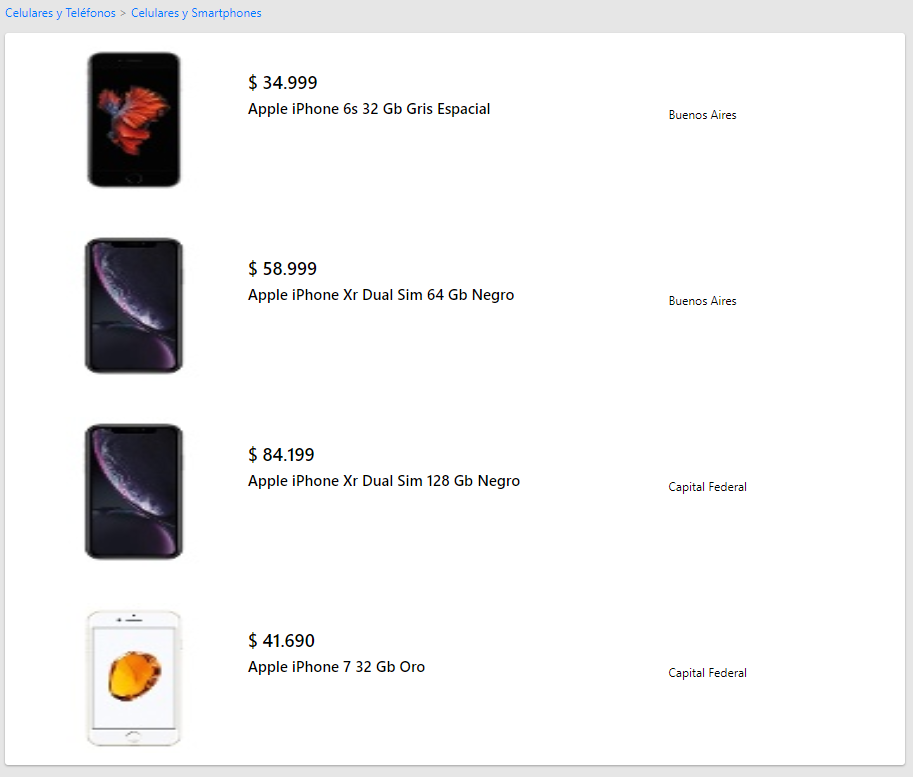
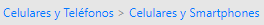

# MeLi Search
## Installation
In the project directory run the following line to install the project dependencies:

`npm run prereq`

To run the project add the following line

`npm run start`

This will start an instance of the app on [http://localhost:3000](http://localhost:3000).<br />

The page will reload if you make edits.<br />
You will also see any lint errors in the console.

## Documentation


This project is separated on three different views:

- Search Bar
- Product Search List
- Product

### View
For the View React-Router was used to create routes. These are defined on the App.js file

**App.js**
````
    <Router>
        <SearchBar/>
        <Switch>
            <div>
                <Route exact path="/items/:itemId" component={Product}/>
                <Route exact path="/items" component={ProductSearchList}/>
            </div>
        </Switch>
    </Router>
 ````
The search bar is not part of the switch as it should always be shown.

To add a new route, add a `<Route>` item specifying where do you need to be rendered and 
which component it should use.
  
### Components
### Search bar
This view is composed from a SearchBar that uses a SearchBox


####SearchBox
This component builds the following state on creation:

`
this.state = {
             searchQuery: "",
             redirectToSearch: false};
`

The `redirectToSearch` variable allows render the `<Redirect>` component when the search form 
is submitted redirecting to the url `/items?search=` rendering the ProductSearchList
view 

### Product Search List
This view is composed from a ProductSearchList and a ProductItem components.
<table><tr><td>


</td></tr></table>

This component make use of the following react lifecycle components:
- **componentDidMount**:  Call to the `api/items?search=` API building a query string with the
query parsed from the URL.
- **componentDidUpdate**: Parse the URL and compares with the previous query to prevent multiple updates.


It builds the following state on creation:

`this.state = {
             isFetching: true,
             items: [],
             categories: [],
             error: null
};
`
The `isFetching` state allows to manage the rendering of the product list while fetching the
data from the API.

The `error` state allows to stop the rendering and show a custom error page.

#### Product Item
This is a stateless component that receives the product data from the ProductSearchList 
component and renders the item.

### Product
This view is composed from a Product, ProductDetails, ProductDescription and a PriceIte components.

<table><tr><td>


</td></tr></table>

This component make use of the following react lifecycle components:
- **componentDidMount**:  Call to the `api/items/:itemId` API building parsing with the
item parsed from the URL.
- **componentWillMount**: Parse the URL and compares with the previous query to prevent multiple updates.

It builds the following state on creation:

`this.state = {
             isFetching: true,
             items: [],
             error: null
};
`
The `isFetching` state allows to manage the rendering of the product list while fetching the
data from the API.

The `error` state allows to stop the rendering and show a custom error page.

#### Product Details
This stateless component renders the following view with the data obtained from the API.


The price is also rendered from the stateless component PriceItem 

#### Product Description
This stateless component renders the following view with the data obtained from the API.


### Shared components
#### Breadcrumb
This stateless component renders the following view with the data obtained from the API.



The previous view was built from an array of strings.


### Configuration
**IMPORTANT:**
The view uses the endpoint from the API defined on the view/config.js file. This must be changed once the App is deployed.

`export const API_ENDPOINT = https://API-ENDPOINT.com`

### API
The API uses the express framework to handle requests.

The entry point is found on /api/sever.js and it defines the routes and router used. For example:

`app.use('/api/items', itemsRouter);`

To add a new route, you must create a new router and reference it to the url fom this file.

#### Routes
##### Items
The items route understand two calls:

router.get('/:itemId'):

Receives an item Id an retrieves the Product Data from the MeLi Items endpoint 

Returns the following structure if code status is 200.
````
{
    “author”: {
    “name”: String
    “lastname”: String
    },
    “item”: {
        "id": String,
        
        "title": String,
        "price": {
        "currency": String,
        "amount": Number,
        "decimals": Number,
        },
        “picture”: String,
        "condition": String,
        "free_shipping": Boolean,
        "sold_quantity", Number
        "description": String
        "categories": [String]
    }
}
````
router.get('/'):
  
Receives a query strinng from the URl and retrieves the list of Product Data 
from the MeLi Items endpoint
 
Returns the following structure if code status is 200.
 ````
 {
     “author”: {
     “name”: String
     “lastname”: String
     },
     “item”: {
         "id": String,
         
         "title": String,
         "price": {
         "currency": String,
         "amount": Number,
         "decimals": Number,
         },
         “picture”: String,
         "condition": String,
         "free_shipping": Boolean,
         "sold_quantity", Number
         "description": String
         "categories": [String]
     }
 }
 ````

### MeLiClient
A MeLiClient Singleton class is used to make calls to the MeLi endpoints. The calls available are:
- getProductDetails(itemId)
- getProductDescription(itemId)
- getProductCategories(categoryId)
- getProductListFromQuerySearch(queryString)
