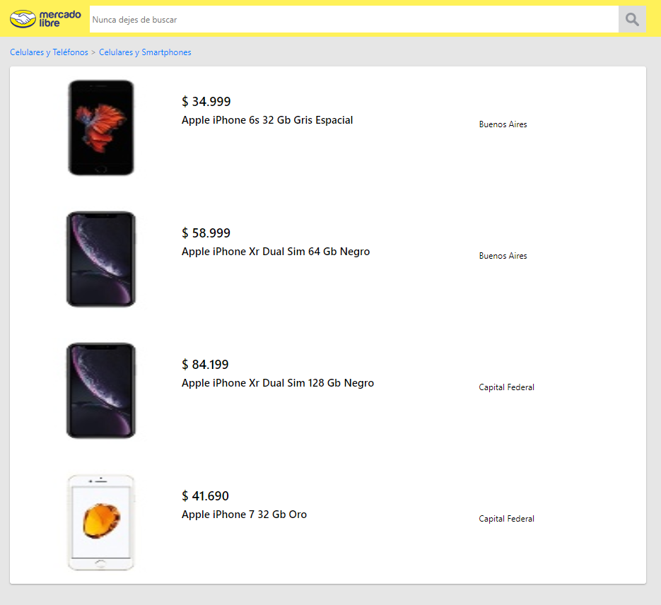

# MeLi Search
## Installation
In the project directory run the following line to install the project dependencies:

 ###`npm run prereq`

To run the project add the following line

###`npm run start`

This will start an instance of the app on [http://localhost:3000](http://localhost:3000). 

The page will reload if you make edits. 
You will also see any lint errors in the console.

## Documentation

This project is separated on three different views

- Search Bar
- Product Details
- Product List

